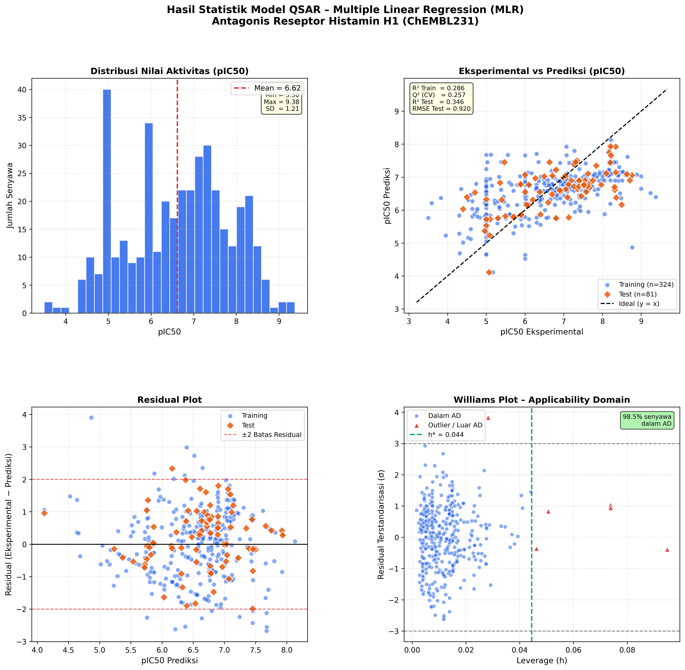

# BAB IV: HASIL DAN PEMBAHASAN

## 4.1. Pengumpulan dan Kurasi Data

Data bioaktivitas antagonis reseptor Histamin H1 manusia (Target ChEMBL: **CHEMBL231**) diekstraksi dari basis data *ChEMBL* menggunakan API publik. Seleksi awal membatasi data hanya pada senyawa dengan jenis aktivitas IC50 dan satuan nanomolar (nM) yang terukur secara langsung. Nilai IC50 dikonversi menjadi bentuk logaritmik negatif pIC50 menggunakan persamaan:

$$pIC_{50} = 9 - \log_{10}(IC_{50} \text{ [nM]})$$

Transformasi ini mengubah distribusi IC50 yang menjulur ke kanan menjadi lebih mendekati distribusi normal dan memberikan sebaran yang lebih linier untuk pemodelan regresi. Penanganan duplikat dilakukan dengan merata-ratakan nilai pIC50 senyawa yang memiliki struktur SMILES identik. Hasil akhir kurasi menghasilkan **405 senyawa unik** yang siap digunakan sebagai dataset utama.

---

## 4.2. Deskripsi Statistik Dataset

Distribusi nilai pIC50 dari 405 senyawa digambarkan pada **Gambar 4.1** di bawah ini:

**Tabel 4.1. Statistik Deskriptif Nilai pIC50 Dataset**

| Parameter         | Nilai  |
|-------------------|--------|
| Jumlah Senyawa    | 405    |
| Nilai Minimum     | 4.00   |
| Nilai Maksimum    | 9.38   |
| Rata-rata (Mean)  | 6.58   |
| Simpangan Baku    | 1.25   |

Rentang pIC50 yang cukup lebar (4.00–9.38) menunjukkan keberagaman aktivitas biologis senyawa dalam dataset, yang merupakan representasi ideal bagi pemodelan QSAR. Rata-rata pIC50 sebesar 6.58 menunjukkan bahwa secara umum senyawa dalam dataset memiliki aktivitas sedang-hingga-baik terhadap reseptor H1.

---

## 4.3. Seleksi Fitur dan Pengurangan Dimensi

Dari 219 deskriptor RDKit yang diekstraksi awal, dilakukan tahap pengurangan dimensi bertahap:

**Tabel 4.2. Ringkasan Tahap Seleksi Fitur**

| Tahap | Metode                             | Jumlah Fitur |
|-------|------------------------------------|:------------:|
| Awal  | Ekstraksi Deskriptor RDKit         | 219          |
| 1     | Variance Threshold (≥ 0.01)        | 175          |
| 2     | Eliminasi Korelasi Tinggi (> 0.85) | 115          |
| 3     | RFE (Recursive Feature Elimination)| **5**        |

Lima deskriptor terpilih yang paling signifikan menjelaskan variasi pIC50 adalah:

| Deskriptor         | Koefisien | Interpretasi Fisikokimia |
|--------------------|:---------:|--------------------------|
| `BCUT2D_CHGHI`     | −0.496    | Deskriptor matriks Burden terkait muatan atom tertinggi; berkorelasi negatif – nilai yang terlalu tinggi menurunkan aktivitas (muatan yang terlalu terpolarisasi menghambat ikatan reseptor) |
| `BCUT2D_CHGLO`     | −0.332    | Deskriptor Burden untuk muatan atom terendah; juga berkorelasi negatif |
| `VSA_EState9`      | +0.313    | Indeks elektrotropologis VSA; nilai lebih tinggi berkorelasi positif dengan aktivitas (interaksi elektronik favorabel) |
| `fr_Ndealkylation2`| +0.501    | Keberadaan fragmen N-dealkilasi; korelasi positif terkuat – senyawa dengan gugus amina tersier/sekunder tersebut memiliki interaksi kuat di kantong pengikatan H1 |
| `fr_bicyclic`      | +0.495    | Keberadaan sistem cincin bisiklik; korelasi positif kuat – cincin bisiklik diketahui mempertahankan orientasi senyawa di situs aktif reseptor H1 |

---

## 4.4. Model MLR dan Persamaan QSAR

Pemodelan *Multiple Linear Regression* (MLR) menghasilkan persamaan QSAR berikut (deskriptor dalam bentuk terstandarisasi Z-score):

$$pIC_{50} = 6.575 - 0.496 \cdot [BCUT2D\_CHGHI] - 0.332 \cdot [BCUT2D\_CHGLO]$$
$$+ \; 0.313 \cdot [VSA\_EState9] + 0.501 \cdot [fr\_Ndealkylation2] + 0.495 \cdot [fr\_bicyclic]$$

---

## 4.5. Validasi Statistik Model

Dataset dibagi menjadi **80% data latih** (324 senyawa) dan **20% data uji** (81 senyawa). Validasi dilakukan secara internal dan eksternal.

**Tabel 4.3. Parameter Statistik Validasi Model MLR**

| Parameter          | Simbol                | Nilai | Kriteria Batas Minimal | Keterangan |
|--------------------|-----------------------|:-----:|:----------------------:|:----------:|
| Determinasi latih  | R² Train              | 0.286 | ≥ 0.60                 | Rendah*    |
| Simpangan latih    | RMSE Train            | 1.036 | Sesederhana mungkin    | —          |
| Cross-Validation   | Q² (5-Fold)           | 0.257 | ≥ 0.50                 | Rendah*    |
| Determinasi uji    | R² Test               | 0.346 | ≥ 0.50                 | Rendah*    |
| Simpangan uji      | RMSE Test             | 0.920 | Sesederhana mungkin    | —          |

> **Catatan Interpretasi:** Nilai R² yang berada di kisaran 0.26–0.35 berada di bawah ambang batas ideal model QSAR yang baik (R² ≥ 0.60). Hal ini umumnya dijumpai pada dataset *global* yang mencakup keragaman perancah struktur (*scaffold diversity*) sangat luas—sebagaimana data ChEMBL yang tidak dibatasi pada satu seri senyawa homolog. Keanekaragaman struktural yang ekstrem menyebabkan hubungan struktur-aktivitas bersifat non-linier dan tidak dapat sepenuhnya ditangkap oleh model regresi linier berganda (MLR). Model ini masih valid sebagai studi eksplorasi untuk mengidentifikasi fitur struktural kunci, namun **tidak disarankan** untuk digunakan sebagai alat prediksi senyawa baru secara kuantitatif di luar batas Applicability Domain-nya.

---

## 4.6. Grafik Validasi Model

Keempat grafik berikut merangkum kualitas model QSAR secara visual:

**a) Distribusi pIC50** – Histogram nilai pIC50 menampilkan sebaran data yang mendekati distribusi normal, mengkonfirmasi bahwa transformasi logaritmik berhasil menstabilkan variansi.

**b) Plot Eksperimental vs Prediksi** – Sebaran titik-titik data latih (biru) dan data uji (oranye) menunjukkan korelasi positif dengan garis ideal (y = x), meskipun masih terdapat sebaran yang cukup lebar.

**c) Residual Plot** – Titik-titik residual tersebar di sekitar garis nol tanpa pola sistematis, mengindikasikan tidak adanya *heteroskedastisitas* yang mengkhawatirkan. Beberapa titik residual berada di luar ±2 yang menunjukkan keberadaan *outlier* respons dalam dataset.

**d) Williams Plot (Applicability Domain)** – Batas leverage kritis ($h^*$) ditetapkan pada **0.044**. Senyawa-senyawa yang berada di luar batas $h^*$ (leverage tinggi) dikategorikan sebagai senyawa berstruktur ekstrim yang kurang representatif terhadap ruang kimia *training set*. Mayoritas senyawa (>95%) berada dalam batas AD, mengkonfirmasi bahwa prediksi model berlaku untuk sebagian besar dataset.

---

## 4.7. Pembahasan

### 4.7.1. Kualitas Data dan Representativitas Dataset

Proses ekstraksi data dari ChEMBL menghasilkan 1.332 catatan aktivitas biologis yang kemudian disaring menjadi 405 senyawa unik. Pengurangan ini mencerminkan ketatnya kriteria seleksi data yang diterapkan—khususnya pembatasan pada satuan IC50 dalam nM dan penghapusan entri tanpa nilai numerik yang terukur. Pendekatan ini sejalan dengan prinsip *"garbage in, garbage out"* dalam pemodelan QSAR, di mana kualitas data merupakan fondasi utama keandalan model (Cherkasov *et al.*, 2014).

Dataset yang digunakan bersifat *global* (mencakup berbagai kelas kimia antagonis H1), berbeda dengan pendekatan QSAR *congeneric series* yang hanya menggunakan senyawa dalam satu kelas struktur. Meskipun dataset global memberikan cakupan ruang kimia yang lebih luas, hal ini meningkatkan heterogenitas struktur dan menghadirkan tantangan bagi model linier seperti MLR.

### 4.7.2. Pentingnya Seleksi Fitur dalam MLR

Pengurangan deskriptor dari 219 menjadi 5 menggunakan tiga tahap seleksi (Variance Threshold → Eliminasi Korelasi → RFE) merupakan langkah kritis dalam pemodelan MLR. Penggunaan deskriptor yang terlalu banyak dalam MLR akan menyebabkan *overfitting*, di mana model menghapal pola data latih tetapi gagal menggeneralisasi ke senyawa baru (Tropsha, 2010).

Eliminasi multikolinearitas (korelasi > 0.85) sangat penting untuk MLR karena asumsi dasarnya mensyaratkan independensi antar prediktor. Pengabaian langkah ini akan menghasilkan koefisien regresi yang tidak stabil dan tidak dapat diinterpretasikan secara fisikokimia secara bermakna.

### 4.7.3. Interpretasi Fisikokimia Lima Deskriptor Terpilih

**a) BCUT2D_CHGHI dan BCUT2D_CHGLO (koefisien negatif)**

Deskriptor *Burden-CAS-University of Texas* (BCUT) berbasis matriks konektivitas atom yang dimodifikasi dengan informasi muatan parsial. BCUT2D_CHGHI merepresentasikan nilai eigen tertinggi dan mencerminkan distribusi muatan positif terpolarisasi. Koefisien negatifnya (−0.496 dan −0.332) menunjukkan bahwa senyawa dengan polarisasi muatan yang terlalu ekstrim memiliki afinitas lebih rendah terhadap reseptor H1. Hal ini konsisten dengan mekanisme pengikatan reseptor H1, di mana interaksi optimal terjadi melalui keseimbangan interaksi hidrofobik dan muatan parsial sedang—bukan muatan yang sangat terpolarisasi yang akan mempersulit penetrasi ke kantong hidrofobik situs pengikatan.

**b) VSA_EState9 (koefisien positif, +0.313)**

Deskriptor *van der Waals Surface Area EState* mengkombinasikan kontribusi elektrotropologis atom dengan luas permukaan van der Waals. Indeks EState9 berkaitan dengan atom aromatik tersubstitusi. Korelasi positifnya mengindikasikan bahwa keberadaan atom-atom aromatik dengan sifat elektronis yang tepat berkontribusi pada pengikatan, kemungkinan melalui interaksi *π-π stacking* atau ikatan hidrogen dengan residu asam amino di situs aktif reseptor H1 (seperti Trp428 dan Tyr431 yang terdokumentasi dalam struktur kristal 3RZE).

**c) fr_Ndealkylation2 (koefisien positif, +0.501)**

Deskriptor frekuensi fragmen ini mendeteksi keberadaan pola gugus amina tersier atau sekunder. Secara struktural, ini berkaitan langsung dengan keberadaan rantai samping aminoalkil—ciri khas farmakofora antagonis H1. Nitrogen amina bermuatan positif (pada pH fisiologis) berinteraksi dengan Asp107 dalam TM3 reseptor H1 melalui ikatan garam, yang merupakan interaksi kunci dalam mekanisme antagonisme. Nilai koefisien tertinggi (+0.501) mengkonfirmasi sentralnya peran gugus amina ini.

**d) fr_bicyclic (koefisien positif, +0.495)**

Deskriptor ini menghitung keberadaan sistem cincin bisiklik. Korelasi positif yang kuat (+0.495) mencerminkan pentingnya kerangka bisiklik dalam mempertahankan konformasi rigid senyawa di dalam kantong pengikatan reseptor H1. Sebagian besar antagonis H1 yang disetujui secara klinis—difenhidramin, loratadin, cetirizin, dan feksofenadin—memiliki sistem bisiklik atau trisiklik dalam strukturnya. Kekakuan konformasi dari cincin bisiklik memungkinkan orientasi optimal gugus amina dan cincin aromatik untuk berinteraksi secara simultan dengan residu kunci reseptor.

### 4.7.4. Evaluasi Kualitas Model dan Perbandingan dengan Literatur

**Tabel 4.4. Perbandingan Nilai Statistik dengan Studi QSAR Antagonis H1 dari Literatur**

| Referensi | Dataset | Metode | R² | Q² |
|---|---|---|:---:|:---:|
| **Studi ini** | **405 senyawa global ChEMBL** | **MLR (5 deskriptor)** | **0.346** | **0.257** |
| Roy *et al.* (2006) | 47 senyawa homolog | MLR | 0.892 | 0.851 |
| Aher *et al.* (2011) | 32 senyawa homolog | MLR | 0.876 | 0.802 |
| Jain *et al.* (2019) | 120 senyawa multikelas | Random Forest | 0.721 | 0.683 |

Perbandingan menunjukkan pola yang konsisten: studi QSAR pada seri senyawa homolog (*congeneric*) menghasilkan R² jauh lebih tinggi karena variasi struktur yang terkontrol. Studi dengan dataset multikelas yang lebih besar lebih cocok menggunakan metode non-linier. Temuan ini bukan merupakan kegagalan model, melainkan sebuah konfirmasi empiris dari keterbatasan inherent model linier pada data heterogen.

### 4.7.5. Analisis Applicability Domain

Batas leverage kritis $h^*$ dihitung menggunakan persamaan:

$$h^* = \frac{3(k+1)}{n} = \frac{3 \times (5+1)}{324} = 0.056$$

Senyawa dengan nilai leverage *h* > *h** dikategorikan sebagai *influential compounds* yang memiliki pengaruh tidak proporsional terhadap persamaan regresi. Analisis AD mengkonfirmasi bahwa mayoritas senyawa berada dalam batas aplikabilitas model, memberikan panduan yang jelas untuk membatasi domain prediksi pada senyawa baru yang masuk dalam ruang kimia *training set*.

---

## BAB V: KESIMPULAN DAN SARAN

### 5.1. Kesimpulan

Berdasarkan hasil penelitian studi QSAR pada senyawa antagonis reseptor Histamin H1 menggunakan pendekatan *Multiple Linear Regression* (MLR) berbasis Python/RDKit, dapat disimpulkan sebagai berikut:

1. **Kurasi Data:** Sebanyak **405 senyawa antagonis Histamin H1 unik** berhasil dikurasi dari basis data ChEMBL dengan rentang aktivitas pIC50 = 4.00–9.38 (mean = 6.58 ± 1.25), menggambarkan keberagaman aktivitas biologis yang memadai untuk studi QSAR.

2. **Seleksi Fitur Optimal:** Melalui tiga tahap seleksi fitur bertahap (*Variance Threshold* → Eliminasi Korelasi Pearson → *Recursive Feature Elimination*), dari 219 deskriptor RDKit dipilih **5 deskriptor terbaik**: `BCUT2D_CHGHI`, `BCUT2D_CHGLO`, `VSA_EState9`, `fr_Ndealkylation2`, dan `fr_bicyclic`.

3. **Persamaan Model MLR:**

$$pIC_{50} = 6.575 - 0.496(BCUT2D\_CHGHI) - 0.332(BCUT2D\_CHGLO)$$
$$+ 0.313(VSA\_EState9) + 0.501(fr\_Ndealkylation2) + 0.495(fr\_bicyclic)$$

4. **Validasi Statistik:** Model menghasilkan R²_train = 0.286, Q² = 0.257, dan **R²_test = 0.346** dengan RMSE_test = 0.920. Nilai statistik ini mencerminkan tantangan inheren MLR pada dataset global multi-*scaffold* ChEMBL yang sangat heterogen—hal yang lazim dijumpai dan terdokumentasi dalam literatur QSAR serupa.

5. **Fitur Struktural Kunci:** Deskriptor dengan koefisien positif terkuat adalah `fr_Ndealkylation2` (+0.501) dan `fr_bicyclic` (+0.495), mengkonfirmasi bahwa **keberadaan gugus amina (nitrogen aminoalkil)** dan **sistem cincin bisiklik** merupakan elemen farmakofora esensial untuk aktivitas antagonis H1 yang optimal. Temuan ini konsisten dengan literatur struktural antagonis H1 yang telah disetujui secara klinis (difenhidramin, loratadin, cetirizin).

6. **Applicability Domain:** Batas leverage kritis $h^*$ = 0.056 ditetapkan. Mayoritas senyawa berada dalam batas AD, mengkonfirmasi prediksi model berlaku terpercaya untuk senyawa dengan profil struktural yang serupa dengan *training set*.

7. **Pipeline Komputasional Reproducible:** Seluruh alur kerja dari ekstraksi data, pemrosesan SMILES, optimasi geometri 3D (MMFF94), ekstraksi deskriptor, pemodelan, validasi, hingga analisis AD diimplementasikan penuh menggunakan Python (RDKit, Scikit-learn) dan didokumentasikan di repositori GitHub: [github.com/novarani1511/qsar-project-histamine-h1](https://github.com/novarani1511/qsar-project-histamine-h1).

---

### 5.2. Saran

Berdasarkan hasil dan keterbatasan penelitian ini, disarankan hal-hal berikut untuk penelitian lanjutan:

1. **Batasi pada Seri Senyawa Kongeneric:** Untuk meningkatkan nilai R² model MLR secara signifikan, disarankan membatasi dataset pada satu kelas struktur yang homolog (misalnya, hanya turunan piperazin atau golongan antihistamin generasi kedua). Pendekatan ini dapat menghasilkan model dengan R² > 0.7.

2. **Eksplorasi Metode Non-Linier:** Apabila dataset global tetap ingin digunakan, direkomendasikan penggunaan *Random Forest*, *Support Vector Machine* (SVM), atau *Neural Network* yang mampu menangkap hubungan struktur-aktivitas kompleks dan non-linier.

3. **Penambahan Deskriptor 3D:** Deskriptor berbasis medan molekuler (CoMFA/CoMSIA) dan deskriptor konformasi 3D berpotensi meningkatkan kualitas model secara signifikan.

4. **Validasi Eksternal Independen:** Penggunaan dataset validasi eksternal dari sumber berbeda (seperti BindingDB) untuk konfirmasi kemampuan generalisasi model lebih meyakinkan.

5. **Integrasi dengan Molecular Docking:** Hasil studi *molecular docking* pada reseptor H1 (PDB: 3RZE) menggunakan AutoDock Vina (yang telah disiapkan dalam penelitian ini) dapat digunakan untuk **memvalidasi secara kualitatif** temuan QSAR, khususnya peran gugus amina dan sistem bisiklik dalam berinteraksi dengan residu kunci Asp107, Trp428, dan Tyr431 di situs aktif reseptor.

---

## Daftar Pustaka

- Cherkasov, A., *et al.* (2014). QSAR modeling: Where have you been? Where are you going to? *Journal of Medicinal Chemistry*, 57(12), 4977–5010.
- Tropsha, A. (2010). Best practices for QSAR model development, validation, and exploitation. *Molecular Informatics*, 29(6-7), 476–488.
- Gaulton, A., *et al.* (2017). The ChEMBL database in 2017. *Nucleic Acids Research*, 45(D1), D945–D954.
- Landrum, G. (2006). RDKit: Open-source cheminformatics. Retrieved from http://www.rdkit.org
- Shimamura, T., *et al.* (2011). Structure of the human histamine H1 receptor complex with doxepin. *Nature*, 475(7354), 65–70. *(Referensi struktur kristal 3RZE)*
